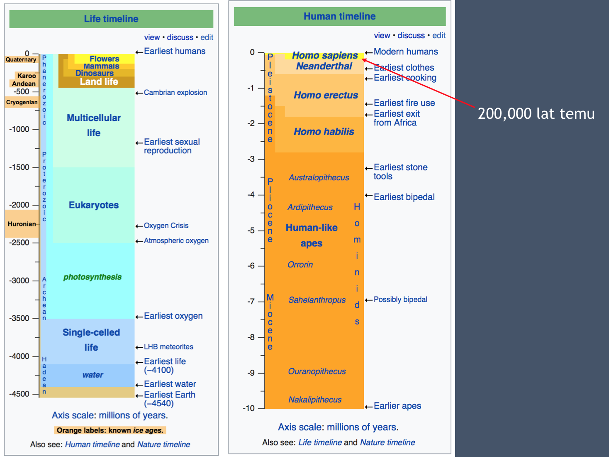
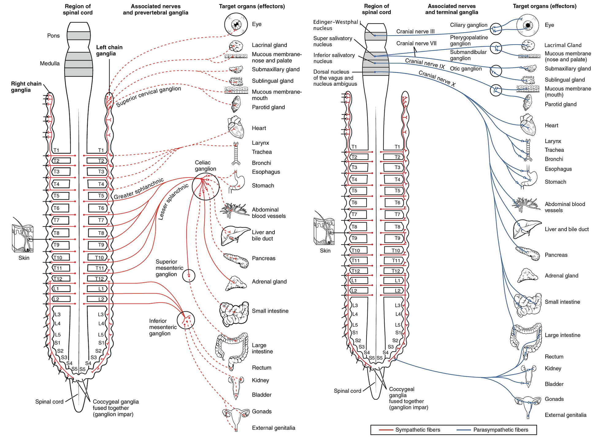
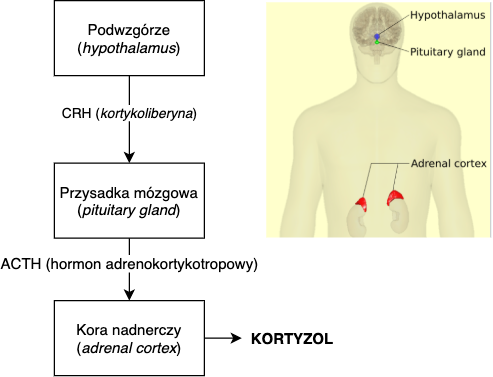
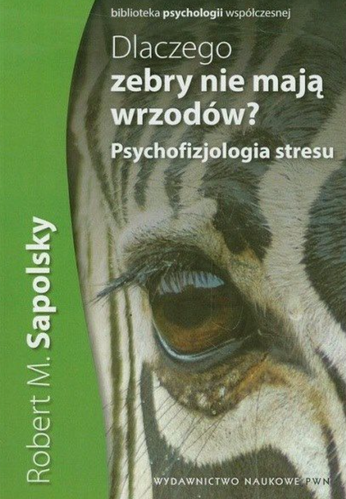

### O mnie

- Krzysztof Basiński
- Katedra Psychologii GUMed
- krzysztof.basinski@gumed.edu.pl
- <http://kbas.gumed.edu.pl>
- <http://kbas.gumed.edu.pl/stres>

### Organizacja

- 4 spotkania
- Forma wykładowo/ćwiczeniowo/warsztatowa
- Przerwy kiedy chcecie

### Przedyskutujcie w grupach

1. Co to jest stres?
2. Co go powoduje?
3. Czym się objawia?
4. Czy jest negatywny czy pozytywny?
5. Jaki jest jego związek ze zdrowiem?

### Stres

- Biologiczny
- Psychologiczny
- ...a może to to samo?

### Stres w biologii

- Stres to odpowiedź organizmu na **stresor**
- Służy odzyskiwaniu homeostazy
- Reakcja stresowa jest **uogólniona** (taka sama niezależnie od stresora)
- Reakcja wytworzyła się w toku ewolucji

### Do jakiego środowiska jesteśmy przystosowani?

---

### Dwa "składniki" stresu

- Autonomiczny układ nerwowy (współczulny/przywspółczulny)
- Oś przysadka-podwzgórze-nadnercza

### Autonomiczny układ nerwowy

- Część obwodowego układu nerwowego
- Reguluje pracę najważniejszych narządów
- Działanie w dużej części nieświadome
- Układ współczulny (reakcja walki-ucieczki, _fight-or-flight_)
- Układ przywspółczulny (reakcje _feed-and-breed_ i _rest-and-digest_)

---

### HPA (oś przysadka-podwzgórze-nadnercza)

---

### Stres a homeostaza

- Reakcja stresowa jest w odpowiedzi na zachwianie homeostazy i służy jej przywróceniu
- U ludzi: reakcja stresowa w odpowiedzi na **możliwe i prawdopodobne zachwianie homeostazy w przyszłości**
- To wspaniale, że mamy taką zdolność, ale...
- W XXI wieku jest z tym pewien problem

### Dlaczego zebry nie mają wrzodów?

### Dlaczego zebry nie mają wrzodów?

- Zebry **nie** stresują się:
	- kursem Franka i jego wpływem na koszt kredytu hipotecznego
	- utratą pracy
	- globalnym ociepleniem
	- wzrastającą liczbą wypadków na drogach

### Przedyskutujcie

Jak stres wpływa na poniższe? Jak **przewlekły stres** wpływa na poniższe?
	
1. Układ krążenia
2. Układ trawienny
3. Układ rozrodczy
4. Układ odpornościowy
4. Wzrost i rozwój
4. Mózg

### Ostry stres

### Układ krążenia

- Zwiększenie tętna
- Zwężenie naczyń krwionośnych
- Więcej krwi = więcej energii do mięśni

### Układ trawienny

- Spowolnienie trawienia
- Suchość w ustach

### Układ rozrodczy

- Zahamowanie sekrecji hormonów płciowych 

### Układ odpornościowy

- Większa aktywacja układu odpornościowego - ochrona przed zakażeniem

### Wzrost i rozwój

- Zahamowanie wydzielania hormonu wzrostu

### Mózg

- Lepsza pamięć
- Bystrzejsza percepcja
- Uwaga przełącza się w tryb czujnościowy

