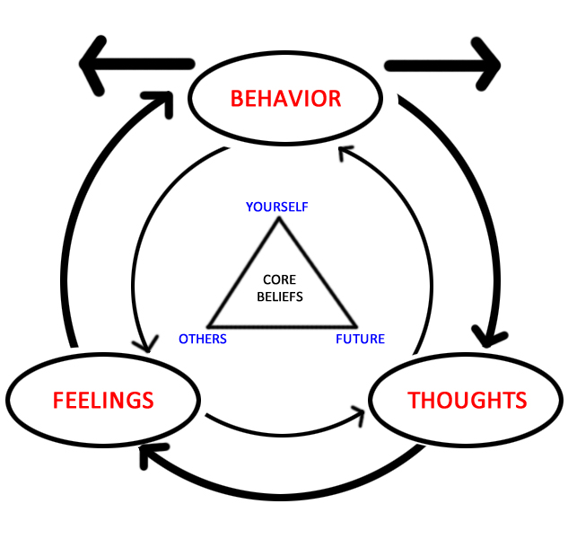

### PTSD - co to takiego?

### PTSD - co to takiego?

- PTSD - *(post-traumatic stress distorder)* - zespół stresu pourazowego
- Zaburzenie psychiczne z grupy zaburzeń lękowych
- Powstaje na skutek traumy
- Nowa jednostka chorobowa (od lat 70., po Wietnamie)
- Wcześniej opisywana jako przypadłość żołnierzy (*shell-shock, battle fatigue*)

### Rys kliniczny (wg. *ICD-10*)

Powstaje jako odpowiedź na silnie stresujące zdarzenie lub sytuację (krótko lub długotrwałe) o szczególnie zagrażającej, katastroficznej naturze, które może wywołać silny dystres u prawie każdego.

### Rys kliniczny (wg. *ICD-10*) cd. 

Czynniki ryzyka, takie jak niektóre cechy osobowości (kompulsywność) czy historia chorób o podłożu nerwicowym zwiększają szanse na rozwinięcie się PTSD, ale nie są konieczne.

### Typowe objawy (wg. *ICD-10*)

- Intruzywne myśli odnośnie traumatycznej sytuacji (flashbacks)
- Koszmary senne
- Poczucie stępienia emocjonalnego
- Odseparowanie się od innych ludzi

### Typowe objawy (wg. *ICD-10*)

- Niereagowanie na bodźce ze środowiska
- Anhedonia
- Unikanie aktywności kojarzących się z traumą
- Nadmierne pobudzenie
- „Hiperczujność”
- Bezsenność

### Typowe objawy (wg. *ICD-10*) cd.

- Silny lęk
- Objawy depresyjne
- Myśli samobójcze
- Uzależnienia od alkoholu i narkotyków

### Kryteria diagnostyczne (wg. *ICD-10*)

1. Silnie stresujące wydarzenie wystąpiło max. 6 miesięcy przed pojawieniem się objawów

### Kryteria diagnostyczne (wg. *ICD-10*)

2. Uporczywe przeżywanie stresującego wydarzenia poprzez intruzywne myśli, koszmary senne, bardzo wyraźne wspomnienia lub przeżywanie dystresu w sytuacjach kojarzących się z traumą

### Kryteria diagnostyczne (wg. *ICD-10*)

3. Unikanie sytuacji i bodźców kojarzących się z traumą (które nie występowało wcześniej)

### Kryteria diagnostyczne (wg. *ICD-10*)
4. Brak możliwości przypomnienia sobie części lub całości wydarzenia traumatycznego

lub

5. Trwałe objawy zwiększonej psychicznej wrażliwości i pobudzenia, w tym co najmniej dwa z poniższych:
  + Problemy ze snem
  + Drażliwość i wybuchy gniewu
  + Podwyższona czujność (hyper-vigilance)
  + Przesadna reakcja na przestraszenie (startle response)
  
### Problemy z postawieniem diagnozy

- Objawy muszą wystąpić dopiero **po** traumie (jeśli są wcześniej, diagnoza jest kłopotliwa)
- Podobne objawy w przebiegu depresji, schizofrenii, psychozy spowodowanej środkami psychoaktywnymi, OCD
- Problem symulantów (renty weteranów wojennych w USA)

### Czynniki ryzyka

Doświadczenie traumy:

- żołnierze
- ofiary katastrof
- ofiary gwałtów i napaści
- jeńcy wojenni
  
### Czynniki ryzyka, cd

- Bycie świadkiem traumy (ratownicy medyczni)
- Dzieci do 10 r.ż. - mniejsza szansa wystąpienia PTSD
- Czynniki genetyczne - ok. 30% wariancji (badania na bliźniętach walczących w Wietnamie)
- Neurofizjologia - mniejsza objętość hipokampa

### Metody prewencji PTSD

- Debriefing psychologiczny
- Trauma Risk Management (TRiM)
- Wczesna terapia poznawczo-behawioralna (CBT)

### Metody leczenia PTSD

- Terapia poznawczo-behawioralna skoncentrowana na traumie (TFCBT)
- EMDR - *eye-movement desensitisation and reprocessing*
- Terapie desensytyzacyjne
- Mindfulness
- Terapie behawioralne (3 gen)

### Leczenie farmakologiczne
- Standard - leki przeciwdepresyjne (SSRI)
- Benzodiazepiny (stosowane coraz rzadziej - kiepska współpraca w terapii, skutki uboczne i uzależnienia)
- Glukokortykoidy - czasem, w celu zapobiegania procesom neurodegeneracyjnym

### Inne metody leczenia

- Wsparcie środowiskowe (rodzina, przyjaciele)
- Arteterapia
- Sport, wysiłek fizyczny

### Inne metody leczenia

### Epidemiologia

Dane amerykańskie:
- 6,8% populacji dotknięta PTSD w którymś momencie życia 
- Mężczyźni 3,6%, kobiety 9,7% 
- U weteranów wojennych wskaźnik rośnie do 30%

### Disability-adjusted life year (DALY)

### DALY dla wszystkich chorób

### DALY dla PTSD

### Epidemiologia PTSD

- Kobiety **DUŻO CZĘŚCIEJ** niż mężczyźni
- W globalnej wariancji DALY dla PTSD udział mężczyzn jest stały (ok. 30 lat na 100 tyś mieszkańców) 
- Za różnice pomiędzy krajami odpowiadają kobiety (od 86 w Tajlandii do 60 w Brazylii)

### Metody prewencji

### Metody prewencji

- Debriefing psychologiczny 
- Trauma Risk Management (TRiM)
- Wczesna terapia poznawczo-behawioralna

### Debriefing psychologiczny (CISM)

- Ogólne określenie na metody wsparcia psychologicznego *zaraz po* wystąpieniu traumy
- Najczęściej stosowana metoda - *Critical Incident Stress Management (CISM)*
- *Debriefing* - pojęcie z nomenklatury wojskowej (*briefing* przed misją, *debriefing* po)

### CISM - założenia

- Metoda szybkiego wsparcia stosowana od 24 do 72 godzin po traumatycznym zdarzeniu
- Cele:
    - Jak najszybszy powrót do "normalnego" życia
    - Zmniejszenie ryzyka wystąpienia PTSD
- Terapia grupowa
- Prowadzący - dowolny człowiek przeszkolony w CISM (nie tylko psycholog)

### CISM - etapy

- Defusing (24h po)
- Debriefing (do 72h po)
- Follow-up (do tygodnia po)

### Defusing (rozbrojenie)

- Wykonywane tego samego dnia co zdarzenie traumatyczne (zanim poszkodowany pójdzie spać)
- Etap indywidualny
- Zapewnienie, że przeżycia i emocje są normalne dla traumatycznej sytuacji
- Informacja o niepokojących symptomach (objawach PTSD)
- Informacja o miejscach, w których można uzyskać pomoc psychologiczną

### Debriefing - cele

- W ciągu 72h od zdarzenia traumatycznego
- Umożliwia ofiarom "wygadanie się" i otrzymanie wsparcia ze strony grupy
- Podpowiada sposoby radzenia sobie ze stresem
- Identyfikuje osoby szczególnie zagrożone
- Informuje o dostępnych sposobach wsparcia

### Debriefing - etapy

- Przedstawienie się prowadzącego i ofiar
- Ofiary mówią o szczegółach zdarzenia ze swojej perspektywy
- Ofiary mówią o swoich reakcjach emocjonalnych na zdarzenie
- Dyskusja o objawach, które pojawiły się od czasu zdarzenia
- Zapewnienie prowadzącego, że *każdy z wymienionych objawów jest normalną reakcją na nienormalną sytuację*
- Nieformalna dyskusja na zakończenie

### Debriefing - założenia

- Uczestnictwo w procedurze może być obowiązkowe, aktywność w trakcie już nie
- Prowadzący powinien zawsze obserwować osoby, które *nie radzą sobie dobrze z sytuacją* i oferować dodatkowe wsparcie
- Sesje są poufne (z wyjątkiem sytuacji, w której uczestnik może stanowić zagrożenie dla siebie lub dla otoczenia)
- Po debriefingu powinien nastąpić follow-up (w ciągu tygodnia)

### Debriefing - skuteczeność

- Terapia bardzo szeroko stosowana (w wielu sytuacjach, na wielu grupach)
- Skuteczność **niepotwierdzona**
- Niektóre badania wskazują na **szkodliwość** CISM (van Emmerik et al. 2002, Roberts et al. 2009)
- APA (American Psychological Association) uznaje metody debriefingu psychologicznego za metody *„niepotwierdzonej skuteczności/potencjalnie szkodliwe”*

### Debriefing - skuteczność

- Być może problemem jest jedynie etap debriefingu, w którym ofiary się ponownie traumatyzują
- Być może CISM działa jedynie na pracowników służb ratowniczych a nie na incydentalne ofiary (Jacobs, Horne-Moyer i Jones, 2004)

### Trauma Risk Management - TRiM

- Metoda powstała w armii brytyjskiej jako alternatywa dla nieskutecznego CISM
- Adresowana dla przedstawicieli zawodów silnie narażonych na traumę
- Szeroko używana w UK przez służby ratownicze, adaptowana w innych środowiskach (np. fundacje charytatywne, firmy ochroniarskie, agendy rządowe, branżę paliwową, koncerny medialne)

### TRiM - model działania

- W kilka dni po silnej traumie przeprowadza się wywiad z poszkodowanym
- Wywiad przeprowadza jego kolega po fachu, przeszkolony w TRiM
- Wywiad ma na celu wyłonienie specyficznych czynników ryzyka, które wiążą się w perspektywie z pogorszeniem zdrowia psychicznego
- Nie rozmawiamy o traumatycznych wydarzeniach, tylko o *symptomach* obecnych u danej osoby

### TRiM - model działania

- Prowadzący oszacowuje ryzyko na skali punktowej wg. algorytmu
- Osoby, które mają odpowiednio dużo punktów otrzymują wsparcie ze strony kolegów oraz bezpośrednich przełożonych
- Po miesiącu wywiad jest ponawiany
- W zależności od wyniku osoba może być kierowana na konkretną terapię

### TRiM - skuteczność

- Relatywnie nowa forma oddziaływania - mniej badań niż dla CISM
- Badania pokazują skuteczność TRiM wśród żołnierzy, ratowników medycznych, policjantów w UK

### Metody terapii

- Terapia poznawczo-behawioralna skoncentrowana na traumie
- EMDR - *eye movement desensitisation and reprocessing*
- Terapie desensytyzacyjne
- *Mindfulness*
- Terapie behawioralne (3gen)

### Terapia poznawczo-behawioralna (CBT) - co to takiego?

- Forma psychoterapii, powstała jako narzędzie leczenia depresji
- Obecnie używana w wielu zaburzeniach psychicznych, w tym PTSD
- Celem jest rozwiązanie konkretnych, aktualnych problemów jednostki poprzez zmianę zachowania oraz myślenia
- Stanowi kombinację metod terapii poznawczej i terapii behawioralnej

---

### CBT - założenia

- Zachowanie, procesy myślenia i procesy emocjonalne są wzajemnie powiązane
- Zaburzenie powstaje jako skutek wadliwego działania jednego z tych procesów
- Zachowanie ludzkie nie zawsze opiera się na racjonalnym myśleniu
- Czasem może być spowodowane procesami warunkowania, na bazie których powstały nie przystosowawcze reakcje

### Komponent behawioralny 

- Znalezienie zachowań „krytycznych” (ważnych dla problemu)
- Stwierdzenie czy zachowania mają charakter deficytowy czy nadmiarowy
- Ocena zachowań pod względem częstotliwości, czasu trwania i intensywności
- W przypadku zachowań deficytowych – próba **zwiększenia** częstotliwości/czasu/intensywności
- W przypadku zachowań nadmiarowych – próba **zmniejszenia** częstotliwości/czasu/intensywności 

### Desensytyzacja / ekspozycja

- Metoda stosowana w leczeniu zaburzeń lękowych
- Oparta na warunkowaniu klasycznym
- Celem jest oduczenie pacjenta awersyjnej reakcji na bodziec lękowy, który w istocie jest bezpieczny
- Ustala się hierarchię bodźców lękotwórczych od najmniej do najbardziej intensywnego
- Pacjent stopniowo zaznajamia się z coraz bardziej lękowymi sytuacjami, jednocześnie stosując wyuczoną wcześniej technikę relaksacji

### Komponent poznawczy

- Odnalezienie i zmiana tzw. zniekształceń poznawczych – błędów w myśleniu, takich jak:
- Przesadna generalizacja
- Skupienie się na negatywach
- Minimalizowanie pozytywów
- Katastroficzne myślenie
- Odnalezienie i zmiana wadliwych sposobów radzenia sobie (coping skills)
- Nauka umiejętności pomagających w radzeniu sobie

### Forma CBT używana w leczeniu PTSD – *Cognitive Processing Therapy*

- Istotą PTSD są błędne przekonania o przyczynach i konsekwencjach traumy, które powodują silne negatywne emocje – strach, gniew, poczucie winy, wstyd.
- Istotne jest też unikanie jako strategia radzenia sobie
- Leczenie podzielone jest na trzy stadia
- Forma grupowa lub indywidualna
- 12 50-minutowych sesji (w wersji indywidualnej)

### Cognitive Processing Therapy - 1 faza

- Zrozumienie istoty choroby – przedstawia się pacjentowi teorię poznawczą rozwoju PTSD
- Pacjent opowiada (albo pisze) o tym, dlaczego trauma się wydarzyła i jaki miała na niego wpływ
- Identyfikuje się tzw. „punkty zacięcia” – problematyczne przekonania utrudniające wyjście z choroby, np. „to moja wina”, „powinienem się bardziej postarać”, „świat jest niebezpieczny”, „nie zasłużyłem sobie na to, by być szczęśliwy”

### Cognitive Processing Therapy - 2 faza

- Pacjent piszę lub opowiada ze szczegółami o swojej traumie, przez co przerywa proces unikania
- Celem jest odnalezienie przekonań, reakcji emocjonalnych i sposobów radzenia sobie, które są problematyczne
- Terapeuta dyskutuje z pacjentem o wydarzeniu i jego reperkusjach, używając tzw. pytań sokratejskich

### Pytania sokratejskie

- Jakie dowody popierają to przekonanie? Jakie mu przeczą?
- Jakie może być inne wytłumaczenie tej sytuacji? Dlaczego jeszcze to się stało?
- Jakie są najgorsze, najlepsze, znośne i najbardziej realistyczne możliwe rezultaty?
- Jakie są skutki takiego przekonania? Jakie mogą być skutki myślenia w inny sposób? 
- Wyobraź sobie, że twój przyjaciel/członek rodziny jest w tej samej sytuacji. Czy myślałby o niej w ten sam sposób?

### Cognitive Processing Therapy - 3 faza

- Praca nad umiejętnościami, pozwalającymi na zmianę wadliwych przekonań
- Koncentracja na „punktach zacięcia” i sposobach ich zmiany
- Koncentracja na pięciu obszarach:
    - Bezpieczeństwo
    - Zaufanie
    - Kontrola/władza
    - Samoocena
    - Intymność

### Cognitive Processing Therapy - skuteczność

- Standard w leczeniu PTSD – Cognitive Processing Therapy połączona z desensytyzacją i farmakologią (SSRI), czasem EMDR (Veterans Health Administration, USA)
- Wydaje się, że terapia poznawczo behawioralna wspomagana farmakoterapią jest najskuteczniejszą znaną obecnie formą leczenia PTSD
- Dyskusja dalej trwa, np. niejasna jest rola komponentów poznawczych

